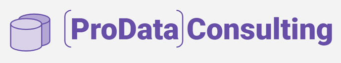
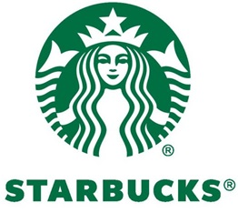

#   

# ProData Consulting x Starbucks USA

## Descripción del Proyecto

Este proyecto presenta una consultoría para la empresa de café Starbucks, en particular para su mercado dentro de los Estados Unidos.

## Partes del Proyecto

### Evaluación del Estado de la Marca

La primera parte del proyecto consiste en una evaluación del estado de la marca. Se mide la valoración general de los consumidores a partir de reviews de Yelp y Google Maps. De esta evaluación surgen:

### Principales críticas: Elementos que suelen aparecer en las valoraciones negativas.

Fortalezas de la marca: Aspectos positivos destacados por los clientes.
Valoración general de la marca.

### Identificación de Oportunidades de Crecimiento

La segunda parte del proyecto se centra en identificar oportunidades de crecimiento de la marca, reforzando sus fortalezas y corrigiendo los elementos críticos.

Además, se compara a Starbucks con su principal competidor en el sector, Dunkin' Donuts, evaluando el posicionamiento de ambas marcas en el mercado y buscando establecer firmemente a Starbucks como líder.

## KPIs

El proyecto se propone medir y evaluar los siguientes KPIs:

### Temática: Competencia

Dado que en el sector de cafeterías la percepción del cliente es clave para el éxito y la sostenibilidad de la marca, es fundamental para Starbucks seguir consolidando su posición frente a sus competidores. Por lo tanto, se definió el siguiente KPI:

#### KPI: Que la puntuación promedio de Starbucks sea superior en un 10% a la de su principal competidor durante los últimos 6 meses.

### Temática: Satisfacción del Cliente

Identificar las principales causas de insatisfacción entre los clientes y tomar medidas efectivas para mejorar esos aspectos es fundamental para el crecimiento continuo. Lograr una reducción significativa en la cantidad de reviews negativas mejora la fidelización de los clientes y la reputación de la marca. A partir de estos puntos, se generó el siguiente KPI:

#### KPI: Disminuir en un 15% el porcentaje de reviews negativas asociadas a un factor específico, medido a nivel semestral.

Ejemplo: Si el 50% de los comentarios negativos son que el café está frío, reducir ese porcentaje en un 15% el siguiente semestre.

### Temática: Crecimiento de la Marca

Fomentar un mayor número de reseñas de clientes es clave para obtener retroalimentación constante y mejorar la reputación de Starbucks. Un mayor número de reviews no solo proporciona información útil para mejorar la experiencia del cliente, sino que también aumenta la visibilidad y credibilidad del restaurante en plataformas de reseñas y redes sociales. Por lo tanto, se definió el siguiente KPI:

#### KPI: Aumentar en un 5% el porcentaje de usuarios que reseñan el restaurante, medido a nivel cuatrimestral.

## Aplicación de Machine Learning

Aplicación Desplegada en GCP - Usando un contenedor de Docker y Streamlit

## https://python-slim-r4rx7cxs5q-ue.a.run.app/

#### Detección de Reseñas Manipuladas
Beneficio: Identifica si una reseña es auténtica o manipulada, ayudando a mantener la credibilidad y confianza en las opiniones de los clientes.
Uso:
Entrada: Texto de la reseña y la calificación.
Proceso: Análisis del texto con técnicas avanzadas.
Salida: Clasificación de la reseña como 'Falsa' o 'Genuina'.

#### Análisis de Sentimiento
Beneficio: Entiende rápidamente la percepción de los clientes mediante la evaluación del sentimiento de sus comentarios.
Uso:
Entrada: Texto de la reseña.
Proceso: Análisis del sentimiento.
Salida: Representación visual (emoji) del sentimiento (negativo, neutral, positivo).

#### Predicción de Calificación del Negocio
Beneficio: Anticipa la calificación futura de un negocio a partir de reseñas recientes, facilitando la toma de decisiones estratégicas.
Uso:
Entrada: Texto de la reseña y la calificación actual.
Proceso: Análisis y predicción.
Salida: Calificación predicha y recomendaciones.

#### Clasificación y Etiquetado de Reseñas
Beneficio: Organiza las reseñas en categorías relevantes, proporcionando una visión clara y estructurada de las opiniones de los clientes.
Uso:
Entrada: Texto de la reseña.
Proceso: Clasificación y etiquetado automático.
Salida: Informe con las frecuencias de las categorías y gráficos visuales.
Resumen
Estas funcionalidades permiten obtener insights valiosos sobre la autenticidad, el sentimiento, la calificación y la categorización de las reseñas, mejorando la toma de decisiones y la estrategia de negocio basada en las opiniones de los clientes.
